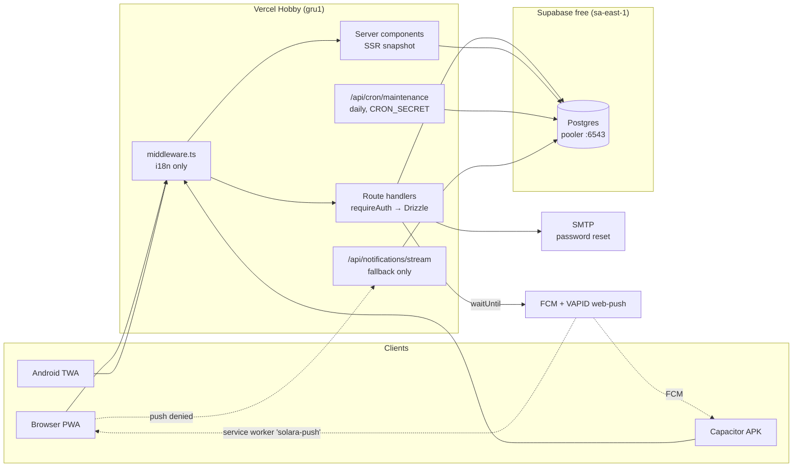

# SYSTEM_DESIGN.md — Solara Plural

> Authoritative system design: architecture, security model, zero-cost budget,
> operations, and invariants. Supersedes the infrastructure sections of
> `ARCHITECTURE.md` (which predates the Supabase migration). Read this before
> any structural, security, or infrastructure change.

Last updated: 2026-07 (system-design overhaul).

---

## 1. Architecture overview

Solara Plural is a Next.js 14 (App Router) PWA deployed on **Vercel Hobby**
(region `gru1`, São Paulo), backed by **Supabase Postgres free tier**
(`sa-east-1`, accessed through the transaction pooler on port 6543 with
`prepare: false`). Push delivery uses **FCM** (Android/Capacitor) and
**self-keyed VAPID web-push** (browsers). Transactional email (password reset)
goes through generic **SMTP**. There is no other backend service — and by
design there must never be a paid one.

Key properties:

- **Serverless-only compute.** Every server entry point is a Vercel function.
  Nothing long-running except the SSE fallback (bounded at 55 s, see §5).
- **Single database.** All state lives in one Postgres schema (~30 tables).
  No Redis, no KV, no blob store, no queue. In-process fan-out
  (`lib/notifications/realtime-broker.ts`) is a same-instance fast path only;
  cross-instance delivery rides on push + the SSE fallback's DB poll.
- **The client is aggressively cached, the server is always truth.** SWR
  paints from a persistent per-user localStorage cache instantly, then always
  revalidates with `cache: 'no-store'` (`lib/swr.ts`), bypassing the HTTP and
  service-worker caches for API reads.

## 2. Data model summary

~30 tables in `lib/db/schema.ts`, grouped:

| Group | Tables | Notes |
|---|---|---|
| Identity | `systems`, `password_reset_tokens`, `rate_limits`, `app_settings` | `systems` is the account root |
| Members & fronting | `members`, `custom_fields`, `member_field_values`, `member_external_links`, `front_entries` | `front_entries.member_ids/member_tiers` are JSON text |
| Social | `system_friend_requests`, `system_friendships`, `system_friend_member_shares`, `system_blocks`, partnership tables, chat tables | sharing is per-friend, per-member, per-field |
| Content | `system_notes`, `system_journal` | user content — never auto-pruned |
| Notifications | `notifications`, `notification_deliveries`, `notification_push_tokens`, `system_integrations` | operational exhaust — pruned by cron |
| Admin | `admin_announcements`, `admin_audit_log` | audit pruned at 180 d |

**Cascade rule (load-bearing):** every user-data table references
`systems.id` with `onDelete: 'cascade'` (41 FK constraints). Deleting a
`systems` row deletes the whole account atomically — this is what makes the
account purge in the maintenance cron a single `DELETE`.

## 3. Request & data flow

1. **First paint:** the dashboard home is a server component that batches its
   queries and passes an SSR snapshot to the client (`HomeContent` receives
   `fallbackData` for SWR) — no spinner flash, no layout shift.
2. **Client data:** all client pages read through SWR with the shared fetcher
   (`lib/swr.ts`, `cache: 'no-store'`). Mutations write server truth straight
   into the SWR cache (`mutate(key, data, { revalidate: false })`) so
   successive edits never build on stale state.
3. **Realtime:** when a friend's front changes, the API route calls
   `waitUntil(notifyFriendsAboutFrontChange(...))` → a `notifications` row per
   friend → push delivery (FCM / web-push). The service worker receives the
   push and posts `solara-push` to open tabs; `NotificationRuntime`
   revalidates SWR on that message. **SSE is a fallback only** for browser
   sessions where push permission is not granted (§5).
4. **Offline/repeat visits:** the service worker (`public/service-worker.js`)
   caches immutable `_next/static` assets cache-first and API GETs
   stale-while-revalidate (bypassed by the SWR fetcher's `no-store`; still
   serves native-app cold paints). HTML is never cached (session data).

## 4. Security model

### Authentication
- NextAuth v5 (Credentials provider), JWT sessions, default hardened cookies
  (`httpOnly`, `sameSite=lax`, `__Secure-` prefix in production).
- Passwords: bcrypt cost 12 everywhere (register, login compare, reset).
- Login is rate-limited inside `authorize(credentials, request)` using the
  durable limiter: `login:ip:*` 30/15 min, `login:email:*` 10/15 min.
  Blocked attempts return `null` → the generic invalid-credentials UI
  (no oracle).
- Suspended accounts (`systems.suspendedAt`) cannot log in.
- Password reset: crypto-random 32-byte token, stored SHA-256-hashed,
  30 min TTL, atomic single-use, prior tokens invalidated on issue and on
  use, non-enumerating responses, layered durable rate limits.

### Authorization
- **Invariant: every data route filters by `auth.systemId`** (verified across
  all 21 data route files). `requireAuth()` / `requireSystemAuth()` from
  `lib/api/helpers.ts` are the only entry points; `assertMemberOwnership`
  (`lib/api/member-ownership.ts`) guards cross-table member references.
- Friend sharing enforces friendship + block checks + per-member visibility
  (`hidden`/`profile`/`full`) + per-field visibility on both read and write;
  archived members are never shared; front lists are filtered per viewer.
- `middleware.ts` is i18n-only **by design** — it is not an auth net. A route
  that forgets `requireAuth` is exposed; that is why the invariant above is a
  review requirement for every new route.

### Admin
- Admin = hardcoded owner email allowlist (`lib/auth/admin-allowlist.ts`,
  optionally extended via `ADMIN_EMAILS`). The DB `is_admin` flag alone never
  grants access (`resolveAdmin` re-checks the allowlist on every use). Every
  admin mutation writes `admin_audit_log`. There is deliberately no
  "grant admin" action in the product.

### Cryptography
- Integration tokens (PluralKit) and web-push subscriptions are encrypted at
  rest with AES-256-GCM, keys derived per-purpose via HKDF-SHA256.
  Secret resolution: dedicated env (`INTEGRATIONS_TOKEN_SECRET`,
  `PUSH_SUBSCRIPTION_SECRET`) with `NEXTAUTH_SECRET` fallback.
  **Production fails closed**: if no secret is available, encryption throws
  rather than storing plaintext (legacy `plain.`-marked rows remain readable).

### Rate limits (durable = Postgres `rate_limits`, atomic upsert)

| Route | Key | Limit | Window | Limiter |
|---|---|---|---|---|
| login (authorize) | ip / email | 30 / 10 | 15 min | durable |
| register | ip | 5 | 1 h | durable |
| password-reset request | ip / email | 10 / 3 | 15 min / 1 h | durable |
| password-reset confirm | ip / token | 20 / 5 | 15 min | durable |
| friends invite | system | 20 | 1 h | durable |
| integrations/member-sync | system | 3 | 10 min | durable |
| notifications/test | system | 5 | 10 min | durable |

The durable limiter fails open to the in-memory limiter if the DB is
unreachable (documented trade-off: availability over strictness).
`getClientIp` trusts `x-forwarded-for` — safe on Vercel, which overwrites it.

### Headers (next.config.mjs)
`Content-Security-Policy` (see below), `X-Content-Type-Options: nosniff`,
`X-Frame-Options: DENY`, `Referrer-Policy: strict-origin-when-cross-origin`,
`Cross-Origin-Opener-Policy: same-origin`, `Permissions-Policy` (all sensors
denied), `Strict-Transport-Security` (prod).

CSP (production): `default-src 'self'; script-src 'self' 'unsafe-inline';
style-src 'self' 'unsafe-inline'; img-src 'self' data: blob: https:;
font-src 'self' data:; connect-src 'self'; worker-src 'self';
manifest-src 'self'; media-src 'self'; object-src 'none'; base-uri 'self';
form-action 'self'; frame-ancestors 'none'; upgrade-insecure-requests`.

Trade-off, recorded deliberately: `script-src 'unsafe-inline'` is required by
Next.js hydration without nonce middleware. This CSP therefore mitigates
remote-script injection, clickjacking, base/form hijacking and plugin content
— not inline-script XSS. React escaping + zero `dangerouslySetInnerHTML`
sinks + input caps are the inline-XSS defense. Nonce-based CSP would force
fully dynamic rendering for marginal gain; revisit only if a real sink
appears. `img-src https:` keeps legacy externally-hosted avatars rendering.

### Input validation
- `lib/api/validate.ts` (zero-dependency) is the single source of field caps
  (name/pronouns/role 100, color 32, tags 50×50, description 5 k, member
  notes 10 k, note title 200 / content 20 k / category 50, journal title 200 /
  content 50 k, front note 2 k) and of `isValidAvatarUrl` — `https://` URLs
  (≤ 2048 chars) or `data:image/(png|jpeg|webp|gif|avif);base64,` payloads
  under the cap; everything else (`javascript:`, `data:text/html`, oversize)
  is rejected. **The server is the source of truth for caps** — client-side
  `maxLength` is a courtesy only.
- Known accepted enumeration surface: register returns 409 "account exists"
  (kept for UX; mitigated by the 5/h durable limit). The friends invite no
  longer confirms address existence.

## 5. Zero-cost budget model

Hard constraint: **the project must cost R$ 0/month.** Every free-tier limit
below has a named guardrail in code. Breaking a guardrail is a design
regression even if the feature works.

| Resource | Free limit | What Solara uses | Guardrail |
|---|---|---|---|
| Vercel function compute | 100 GB-h/mo | route handlers (ms each) + SSE fallback | **SSE is permission-gated** (`lib/notifications/sse-gate.ts`): tabs with push granted, and the native app (FCM), never open the stream. Only push-denied browser tabs fall back — 55 s bounded invocations, 30 s DB poll. Estimated ≥ 80 % reduction vs. ungated. |
| Vercel invocations | ~1 M/mo | API reads/writes | SWR deduping (1–4 s), focus-throttle, no polling loops (`refreshInterval: 0`) |
| Vercel cron | 2/day (Hobby) | **1**: `/api/cron/maintenance` daily 06:00 UTC | keep the second slot free |
| Vercel maxDuration | 60 s (Node) | SSE 55 s close; cron ≤ 60 s; member-sync 45 s internal budget | explicit `maxDuration` exports |
| Supabase DB size | 500 MB | rows + **avatars as data URLs** | avatars client-encoded at 256 px WebP ~80 KB (~110 KB base64), server cap enforced in `validate.ts`; ceiling ≈ 4 600 avatars; cron logs total avatar bytes |
| Supabase pooler connections | shared pool | postgres.js client | `max: 5, idle_timeout: 20 s, connect_timeout: 10 s, max_lifetime: 30 min` in `lib/db/index.ts` |
| Supabase row growth | — | append-only op tables | **cron retention** (§6): notifications 60/90 d, deliveries 30 d, rate_limits 1 d past reset, reset tokens 7 d, audit 180 d, revoked push tokens 30 d. `system_chat_messages`, notes, journal are user content — never auto-pruned (future: per-system retention setting). |
| FCM / web-push | free | push delivery | tokens revoked on permanent failure; deliveries pruned |
| SMTP | provider-dependent | password-reset mail only | durable rate limits upstream |
| PluralKit API | free, ~2 req/s | user-initiated sync | sequential requests, 8 s timeouts, 3/10 min route limit, 45 s / 100-op budget per run |

**Cost math that drove the SSE decision:** one foreground tab holding the
stream ≈ one continuous 55 s × 1 GB invocation ≈ 1 GB-h per active hour. Two
engaged daily users (~2 h/day) ≈ 120 GB-h/mo — over the entire Hobby budget.
With gating, push-granted tabs cost zero stream time and still get ~1–2 s
realtime via the service worker's `solara-push` message.

## 6. Operational runbook

### Environment variables

| Var | Purpose | Required |
|---|---|---|
| `SUPABASE_DATABASE_URL` | pooled app connection (:6543) | prod |
| `SUPABASE_DIRECT_URL` | direct connection for migrations (:5432) | migrations |
| `NEXTAUTH_SECRET` | sessions, SSE JWT, crypto fallback | prod |
| `NEXTAUTH_URL` | reset-link base URL | prod |
| `CRON_SECRET` | bearer auth for `/api/cron/maintenance` | prod (cron 503s without it) |
| `INTEGRATIONS_TOKEN_SECRET` (+`_LEGACY`) | PluralKit token crypto | recommended |
| `PUSH_SUBSCRIPTION_SECRET` | push subscription crypto | recommended |
| `NEXT_PUBLIC_WEB_PUSH_VAPID_PUBLIC_KEY` / `WEB_PUSH_VAPID_PRIVATE_KEY` / `WEB_PUSH_VAPID_SUBJECT` | web push | for browser push |
| `FIREBASE_SERVICE_ACCOUNT_JSON` (or split vars) | FCM | for APK push |
| `SMTP_HOST/PORT/USER/PASS/FROM` | reset email | for password reset |
| `ADMIN_EMAILS` | extra admin allowlist | optional |
| `TWA_PACKAGE_NAME` / `TWA_SHA256_FINGERPRINTS` | Android assetlinks | for TWA |

Removed (do not re-add): `CATBOX_USERHASH`, `SSE_URL`, `DATABASE_URL`/
`DATABASE_AUTH_TOKEN` (Turso era).

### Maintenance cron
- `vercel.json` schedules `GET /api/cron/maintenance` daily at 06:00 UTC
  (03:00 São Paulo; Hobby fires within the hour).
- Auth: `Authorization: Bearer $CRON_SECRET` (Vercel sends it automatically).
  Fails closed: 503 if the secret is unset in production, 401 on mismatch.
- Steps (each isolated; one failure doesn't stop the rest — response JSON
  reports per-step counts/errors):
  1. **Account purge**: delete `systems` where `deletion_scheduled_for ≤ now`
     (cascade wipes the account) + audit-log entry. This is the 72 h-grace GC.
  2–7. Retention deletes per the table in §5.
  8. Avatar-bytes metric (no delete) — watch it fall as avatars re-encode.
- Manual run: `curl -H "Authorization: Bearer $CRON_SECRET" https://<host>/api/cron/maintenance`.

### Deploy & release
- Push to `master` → Vercel deploy. CI (GitHub Actions) runs
  `tsc --noEmit`, lint, vitest, build — replicate locally before pushing.
- **Service worker version**: bump `VERSION` in `public/service-worker.js`
  whenever caching behavior or asset expectations change. Clients pick it up
  via `SKIP_WAITING` + `controllerchange` (which revalidates all SWR keys).
- Migrations: `npm run db:generate` / `db:migrate` against
  `SUPABASE_DIRECT_URL` — never the pooler.

## 7. Invariants (the contract for future changes)

1. **Every data route filters by `auth.systemId`.** No exceptions; middleware
   will not save you.
2. **No paid service, tier, or quota may be introduced.** If a feature needs
   one, the feature changes, not the constraint.
3. **No new runtime dependency without a decision recorded here.**
4. **The server owns validation caps** (`lib/api/validate.ts`); clients only
   mirror them.
5. **Long-lived connections must be permission-gated** (SSE only when push is
   unavailable) — one tab must never cost a continuous function.
6. **Every append-only table has a retention rule in the maintenance cron**,
   or a documented exemption (user content: notes, journal, chat).
7. **Avatars live in the DB as bounded data URLs** (256 px / capped base64) —
   no external image hosts for user content.
8. **Secrets fail closed in production** — never store plaintext because an
   env var was missing.
9. **Realtime rides on push first**; SSE/polling are fallbacks, and any new
   realtime feature must justify its compute against §5.
